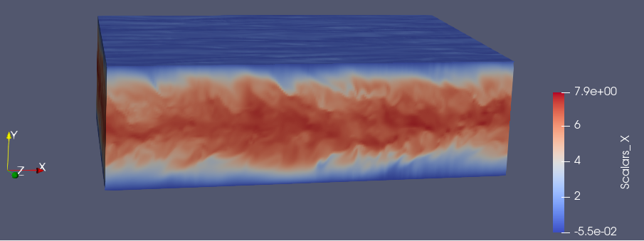
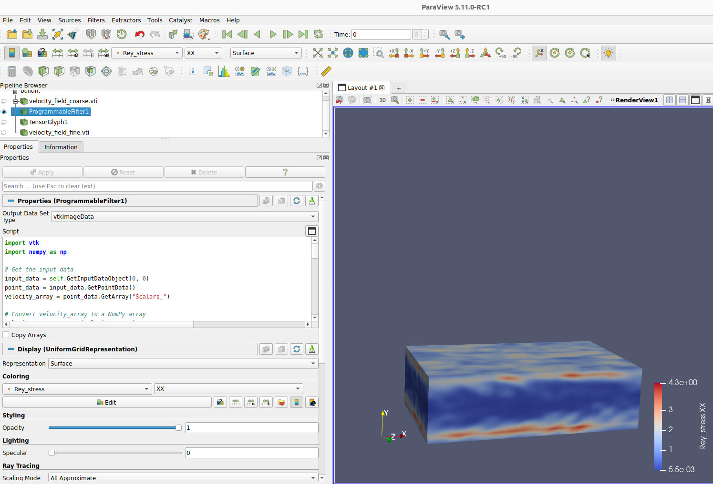
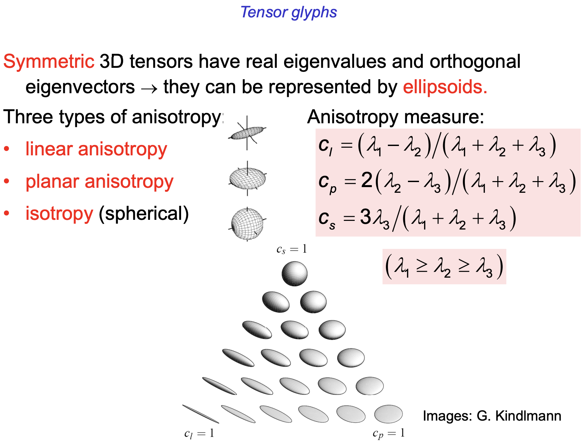

# TensorVis
This is a course project of CSCI596 to explore the visualization of tensor field

---
### Desription
Typically, when in many high-fidelity simulations, we need to deal with tensors, which is hard to visualize. In this project, I explore the tensor visualization using Paraview. More specifically, after obtaining fluid simulation data from DNS (Direct Numerical Simulations), i.e., velocity, pressure, density field, I want to know the turbulence state of the flow, which can be quantified by Reynolds' stress. Then I use the programmable filter in Paraview to do Python coding and use it to compute the Reynolds' stress and visualize it. 

---
### Implementation
Here is a snapshot of the velocity profile in Channel flow by DNS.

Here is how to do Python programming in Paraview.

---
### Results
Here is the computed Reynolds' stress tensor in xx direction

Here is one way to visualize tensor

