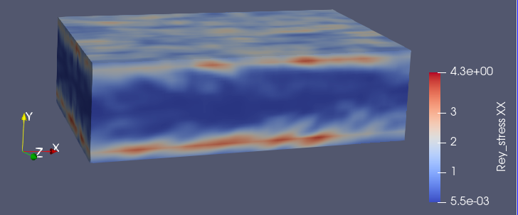

# TensorVis
This is a course project of CSCI596 to explore the visualization of tensor field.

---
### Desription
Typically, when in many high-fidelity simulations, we need to deal with tensors, which is hard to visualize. In this project, I explore the tensor visualization using Paraview. More specifically, after obtaining fluid simulation data from DNS (Direct Numerical Simulations), i.e., velocity, pressure, density field, I want to know the turbulence state of the flow, which can be quantified by Reynolds' stress. Then I use the programmable filter in Paraview to do Python coding and use it to compute the Reynolds' stress and visualize it. 


---
### Theory of tensor visualization

Here is one way to visualize tensor


---
### Implementation
Here is a snapshot of the velocity profile in Channel flow by DNS.


Here is how to do Python programming in Paraview.


Here is code:


---
### Results
Here is the computed Reynolds' stress tensor in xx direction
 

We chose to use spheres to visualize the tensor field. Here is one plot.
 
 

---
### Parallelization 
Note that there is very big for loop, which takes a lot of time. We will proceed with parallel computing using joblib from Python, which use multi-thread processing.

```python
import vtk
import numpy as np
from joblib import Parallel, delayed
# Get the input data
input_data = self.GetInputDataObject(0, 0)
point_data = input_data.GetPointData()
velocity_array = point_data.GetArray("Scalars_")

# Convert velocity_array to a NumPy array
velocity_np = np.array(velocity_array)

# Reshape the NumPy array to the original shape
velocity_np = velocity_np.reshape((input_data.GetNumberOfPoints(), 3))
print(velocity_np.shape)

u = velocity_np[:, 0].reshape([100, 30, 60], order='f')
v = velocity_np[:, 1].reshape([100, 30, 60], order='f')
w = velocity_np[:, 2].reshape([100, 30, 60], order='f')


num_pts = input_data.GetNumberOfPoints()
tensor_array = np.zeros((num_pts, 6))
box_size = 3


def comp_rey_tensor(u, k):
  tensor_array = np.zeros((u.shape[1]*u.shape[0],6))
  counter = 0
  z_left = np.max([0, k - box_size])
  z_right = np.min([u.shape[2], k + box_size])
  for j in range(u.shape[1]):
    y_left = np.max([0, j - box_size])
    y_right = np.min([u.shape[1], j + box_size])
    for i in range(u.shape[0]):
      x_left = np.max([0, i - box_size])
      x_right = np.min([u.shape[0], i + box_size])
      temp_u = u[x_left:x_right, y_left:y_right, z_left:z_right].flatten()
      temp_v = v[x_left:x_right, y_left:y_right, z_left:z_right].flatten()
      temp_w = w[x_left:x_right, y_left:y_right, z_left:z_right].flatten()
      temp_data = np.concatenate((temp_u[np.newaxis, :], temp_v[np.newaxis, :], temp_w[np.newaxis, :]),axis=0)
      rey_stress = np.cov(temp_data, bias=True)
      rey_tensor = np.array([rey_stress[0, 0], rey_stress[1, 1], rey_stress[2, 2], rey_stress[0, 1], rey_stress[1, 2], rey_stress[0, 2]])
      tensor_array[counter] = rey_tensor
      counter += 1
  return tensor_array
# fortran
counter = 0
results = Parallel(n_jobs=-1)(delayed(comp_rey_tensor)(u,k) for k in u.shape[2])
for i in range(u.shape[2]):
  tensor_array[i*(u.shape[0]*u.shape[1]):(i+1)*(u.shape[0]*u.shape[1])] = results[i]

output.PointData.append(tensor_array, "Rey_stress")

```
